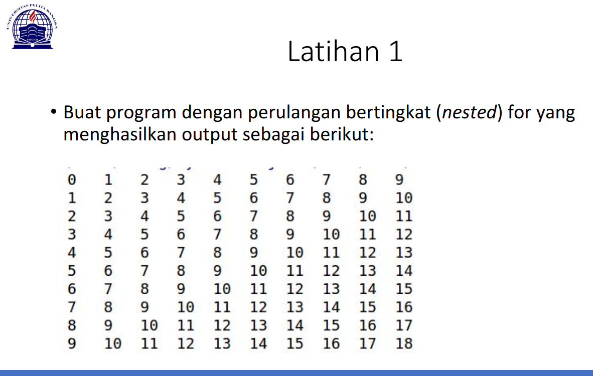

# pertemuan-ke-7 Bahasa Pemrograman

Repository ini dibuat untuk memenuhi tugas bahasa pemrograman pertemuan ke-7
<hr>

Nama  : Ahmad Muafiq<br>
NIM   : 312010152<br>
Kelas : TI.20.B.1<br>
<hr>

Pada modul kali ini saya diberi 2 tugas untuk membuat program sederhana menggunakan Bahasa Pemrograman Python.<br>

## Latihan 1

* Tugas ini saya diminta untuk membuat program sederhana seperti gambar dibawah ini :<br>
<br>

* Setelah membaca dan memahami materi yang diberikan oleh dosen, pada akhirnya saya telah selesai membuat program tersebut, dengan source code seperti dibawah ini :<br>
``` python
print(list(range(0, 10, 1)))
print(list(range(1, 11, 1)))
print(list(range(2, 12, 1)))
print(list(range(3, 13, 1)))
print(list(range(4, 14, 1)))
print(list(range(5, 15, 1)))
print(list(range(6, 16, 1)))
print(list(range(7, 17, 1)))
print(list(range(8, 18, 1)))
print(list(range(9, 19, 1)))
```
